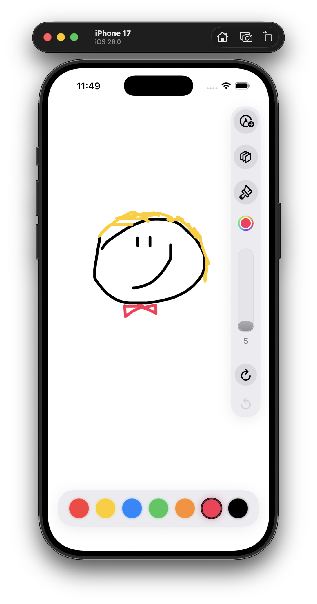
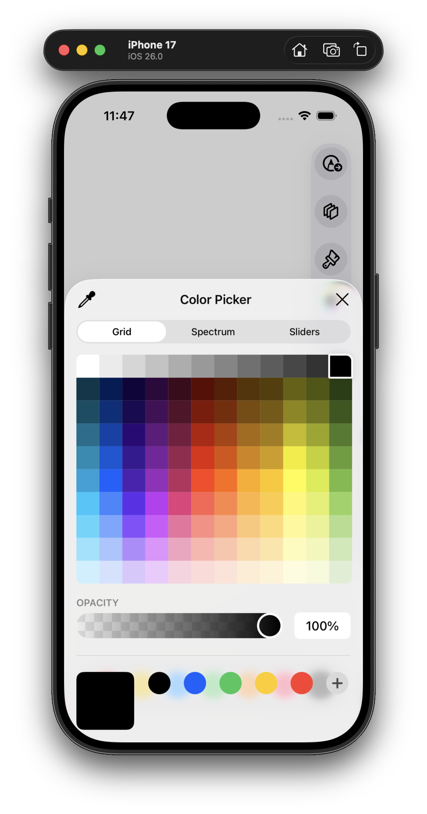
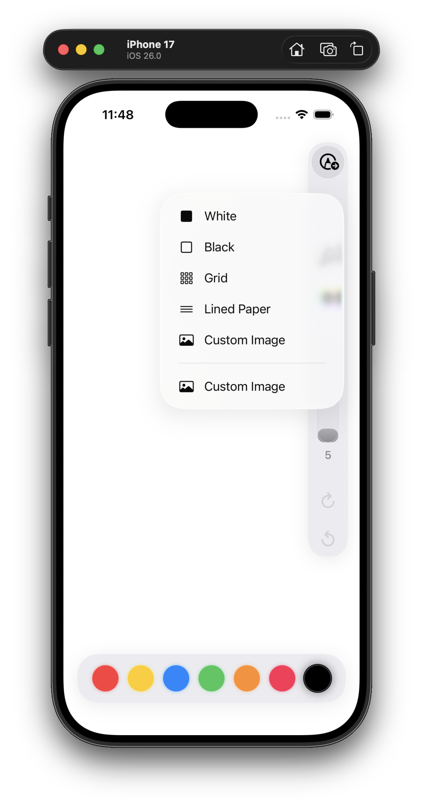

# 🎨 iDibujo

iDibujo is a lightweight drawing app for **iOS/iPadOS** and **macOS**, built with **Swift** and **SwiftUI**. It focuses on a clean canvas-first experience: pick a brush, choose a background, draw, undo/redo, and export your work.

- App Store: [iDibujo](https://apps.apple.com/us/app/idibujo/id1237783038)
- Current iOS marketing version: **1.3.1**

## 🧩 Projects in this repo

- **`iDibujo/` (iOS & iPadOS)**: Main app. Deployment target: iOS **17.6+**.
- **`iDibujo Mac/` (macOS)**: macOS build. Deployment target: macOS **15.4+**.
- **`iDibujoCanvas/` (iOS demo)**: SwiftUI Canvas playground. Deployment target: iOS **18.4+**.

## ✨ Features

- **Drawing**
  - SwiftUI `Canvas` rendering with gesture-driven strokes
  - Adjustable stroke width
  - Multiple brush styles: Pencil, Marker, Paint, Highlighter
- **Color**
  - Quick color palette + system `ColorPicker`
- **Backgrounds**
  - White / Black / Grid / Lined paper
  - Custom background image via `PhotosPicker`
- **Undo / Redo**
  - Buttons
  - Two-finger tap to undo, three-finger tap to redo (iOS)
- **Export**
  - iOS: save snapshot to Photos
  - macOS: export snapshot as PNG (written to a temp file)
- **UX**
  - Light/Dark adaptive UI
  - First-run tutorial popup
  - Accessibility labels/hints for key controls

## 🛠 Tech Stack

- Swift
- SwiftUI
- Canvas API
- PhotosUI / Photo Library (background import + saving on iOS)
- XCTest (unit tests)

## 🚀 Getting Started

1. Open one of the Xcode projects:
   - `iDibujo/iDibujo.xcodeproj`
   - `iDibujo Mac/iDibujo Mac.xcodeproj`
   - `iDibujoCanvas/iDibujoCanvas.xcodeproj`
2. Select a scheme and a destination device/simulator.
3. Build & Run (⌘R).

## 🔐 Permissions (iOS)

iDibujo uses Photo Library permissions for:

- importing an image as the canvas background
- saving a snapshot to Photos

The relevant `Info.plist` keys are:

- `NSPhotoLibraryUsageDescription`
- `NSPhotoLibraryAddUsageDescription`

## 🧪 Testing

Run tests from Xcode:

- Product → Test (⌘U)
- Or run the `iDibujoTests` scheme.

## 📸 Screenshots

  

## 🗺 Roadmap ideas

- In-app gallery / file export picker
- Apple Pencil enhancements
- Wire up the existing zoomable container UI (pinch-to-zoom + pan)

© Copyright, Israel Manzo. All rights reserved.

