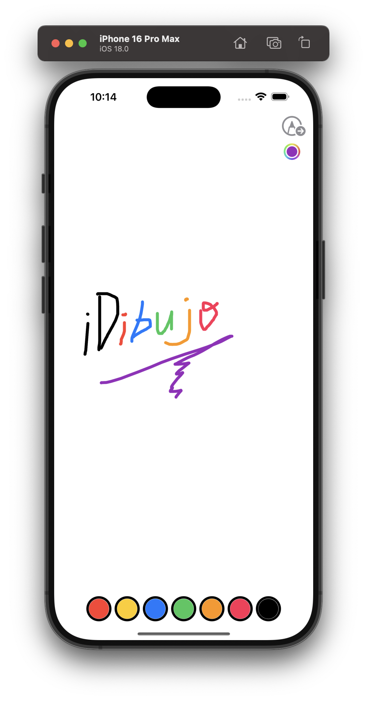
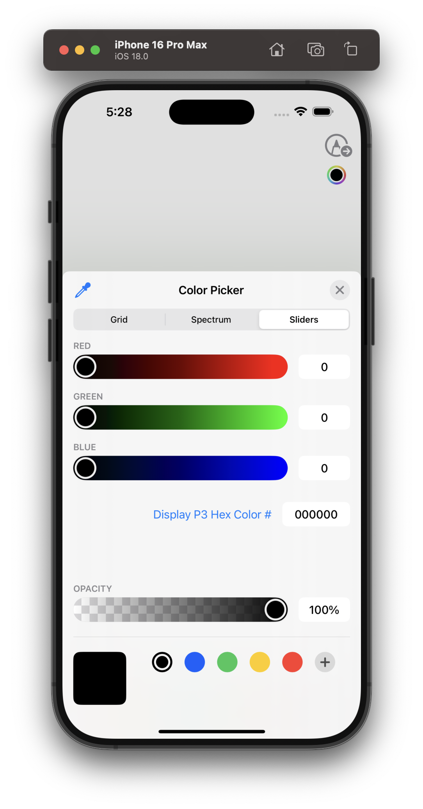

# iDibujo
Effortlessly create simple sketches or breathtaking masterpieces with our intuitive drawing app. :iphone:

> A simple, intuitive app designed for users of all ages, available on the App Store..

 

### Technology

- Version 1.2.1: Our current stable release, featuring key improvements and bug fixes.
- UIKit: Leveraging Apple's robust framework for creating a native, high-quality user interface.
- MVVM Architecture: Implementing a scalable, maintainable codebase through the Model-View-ViewModel pattern, utilizing protocols and delegates to ensure clear separation of concerns.
- Canvas: Enabling dynamic drawing and interactive visual elements for a richer user experience.

### Launch :rocket:
- First release on early 2017

- Second release on later 2019

- Third release on 2025

[iDibujo](https://apps.apple.com/us/app/idibujo/id1237783038)

_**Israel Manzo ®**_
[LinkedIn](https://www.linkedin.com/in/israel-manzo/)

